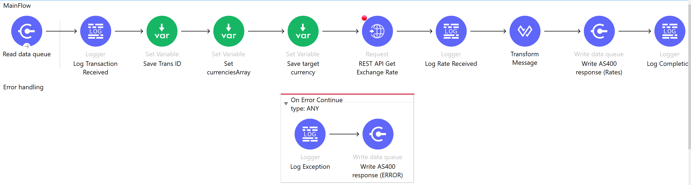
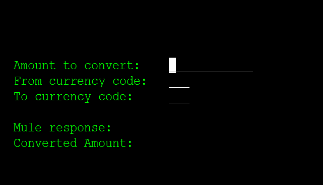

Data Queue operations demo
================

**INTRODUCTION**

This demo addresses a use case where the back-end IBM i (AS/400) process needs execute external API in near real time. In this case, it needs to call a publicly available web service to convert the transaction amount from one currency to another. Mule flow is responsible for calling the external APIs and data transformations. IBM i back-end communicates with Mule flow in real time via the pair of request and response data queues. 

**HOW TO DEMO ON AS400**

1. Set up the IBM i (AS400) connection properties
2. Create and compile the sample program on IBM i per source code and instructions below
3. Run the demo project in Mulesoft studio
4. Call DEMO01R program on IBM i side and provide amount to convert and pair of currency codes. 

**HOW TO DEMO WITH MULE / POSTMAN**
1. Set up the IBM i (AS400) connection properties
2. Run the demo project in Mulesoft studio
3. Open postman collection https://www.getpostman.com/collections/81f06d17390d5aaff8ce
4. Run Write Data Queue request - it will place the data queue entry into the Request data queue DEMO01REQ. 
5. The Listener flow will be triggered by the incoming message, and it will execute an external API call to get the exchange rate for the pair of currencies
6. The result of the listener flow will be placed into DEMO01RES data queue on AS400
7. Run Read Data Queue request - it will read the response (containing the exchange rate) from the response data queue 

**HOW IT WORKS**

Mule application:

1.  listens to AS/400 data queue for requests
2.  calls external currency exchange rate web service
3.  sends the call status and exchange rate back to AS/400 response
        data queue

**IBM i (AS400) code and setup instructions**

1.  Create the request and response data queues

        CRTDTAQ DTAQ(DEMOLIB/DEMO01REQ) MAXLEN(255) SEQ(*KEYED) KEYLEN(20)
        CRTDTAQ DTAQ(DEMOLIB/DEMO01RES) MAXLEN(255) SEQ(*KEYED) KEYLEN(20)

2.  Create display file DEMO01D and a demo RPG program to implement the
    following screen:

    

<!-- -->

    A                                      DSPSIZ(24 80 *DS3)
    A          R MAIN
    A                                      CF03(03 'EXIT')
    A                                 22  2'F3=Exit'
    A                                      COLOR(BLU)
    A                                  1 70DATE
    A                                      EDTCDE(Y)
    A                                  2 70TIME
    A                                  1  3USER
    A                                  2  3SYSNAME
    A                                  2 27'AS/400 to Mule Demo'
    A                                      COLOR(WHT)
    A                                  9  4'From currency code:'
    A                                 10  4'To currency code:'
    A                                  8  4'Amount to convert:'
    A                                 12  4'Mule response:'
    A                                 13  4'Converted Amount:'
    A            AMOUNT        11Y 2B  8 26EDTWRD('         .  ')
    A                                      COLOR(WHT)
    A            FROMCCY        3A  B  9 26COLOR(WHT)
    A            TOCCY          3A  B 10 26COLOR(WHT)
    A            MULERESP      50   O 12 26
    A            TOAMOUNT      11Y 2O 13 26EDTWRD('         .  ')

1.  Create RPGLE maintenance program DEMO01R that

    1.  Takes user input (from and to currency codes and amount to
        trans)

    2.  Generates random transaction ID

    3.  Places from and to currency codes into request data queue with
        key = transaction ID

    4.  Waits for response data queue message with key = transaction ID

    5.  Calculates amount based on received exchange rate, or displays
        error message

<!-- -->

    H DEBUG DATFMT(*ISO)  bnddir('QC2LE')
    fdemo01d   cf   e             workstn

    d sndDtaQ         pr                  ExtPgm( 'QSNDDTAQ' )
    d  DQName                       10    Const
    d  DQLibl                       10    Const
    d  DQLength                      5  0 Const
    d  DQData                      255    Const
    d  DQKeyLength                   3p 0 options(*nopass) const
    d  DQKey                        20    options(*nopass) const

    d rcvDtaQ         pr                  ExtPgm('QRCVDTAQ')
    d   Dtaqnam                     10a   const
    d   Dtaqlib                     10a   const
    d   Dtaqlen                      5p 0
    d   Data                       255
    d   WaitTime                     5p 0 const
    d   Keyorder                     2a   options(*nopass) const
    d   Keylen                       3p 0 options(*nopass) const
    d   Key                         20    options(*nopass) const
    d   Senderlen                    3p 0 options(*nopass) const
    d   Sender                       1    options(*nopass) const
     * Prototype to C "rand" function
    d Rand            PR            10I 0 ExtProc('rand')
     * Prototype to C "srand" function
    d SRand           PR                  ExtProc('srand')
    d   iSeed                       10U 0 VALUE
     * Prototype to C "clock" function
    d GetTime         PR            10I 0 ExtProc('clock')
     * Prototype to C "atof" function
    d atof            pr             8f   extproc('atof')
    d   string                        *   Value Options(*String)
     * Rand variables
    d RandomNumber    S             10I 0
    d ClockTicks      S             10I 0
    d SeedValue       S             10U 0
     * constants for this sample, replace with soft-coded parms
    d c#reqDtaQ       s             10    inz('DEMO01REQ')
    d c#reqDtaQLib    s             10    inz('MULE400DEV')
    d c#resDtaQ       s             10    inz('DEMO01RES')
    d c#resDtaQLib    s             10    inz('MULE400DEV')
    d c#waitsec       s              5p 0 inz(15)
    d msgOut          s            255
    d msgIn           s            255
    d msgKey          s             20
    d msgInLen        s              5p 0

     /free
       exfmt main;
       dow *in03 = *off;
         exsr processSR;
         exfmt main;
       enddo; // *in03 = off
       *inlr = *on;
       return;

       begsr processsr;

         if (fromccy <> *blanks and toccy <> *blanks
           and amount <> 0);
           // Generate trans ID
           ClockTicks = GetTime;
           SeedValue = ClockTicks;
           SRand(SeedValue);
           RandomNumber = Rand();
           msgKey = %char(randomNumber);
           msgOut = fromccy + ',' + toccy;
           snddtaq (c#reqDtaQ : c#reqDtaQLib : %size(msgOut) : msgOut :
                %size(msgKey ) : msgKey );
           // Wait for the response from web service
           msgIn = *blanks;
           toamount = 0;
           rcvdtaq (c#resDtaQ: c#resDtaQLib: msgInLen : msgIn : c#waitsec :
                'EQ': %size(msgKey) : msgKey : 0 : ' ');
           if  msgInLen > 0;
             muleresp   = %subst(msgIn:1:50);
             if %subst(muleresp:1:9) = 'Status=OK';
               monitor;
                 toamount = amount * atof(%subst(msgIn:11));
               on-error;
               endmon;
             endif;
           else;
             muleresp = 'No response from Mule';
           endif; // msgInLen > 0
         endif; // fromccy <> *blanks ...
       endsr;

     /end-free

